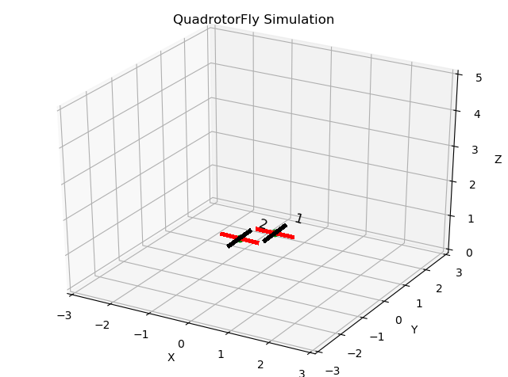
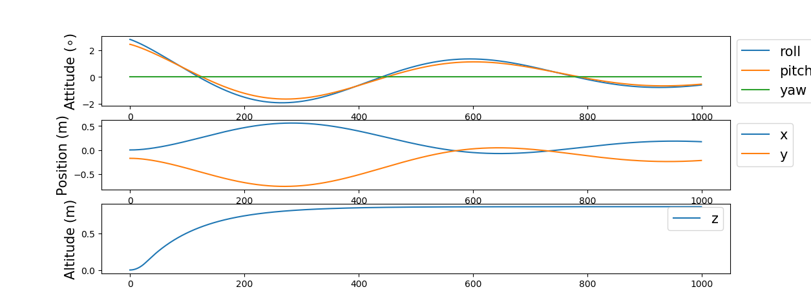
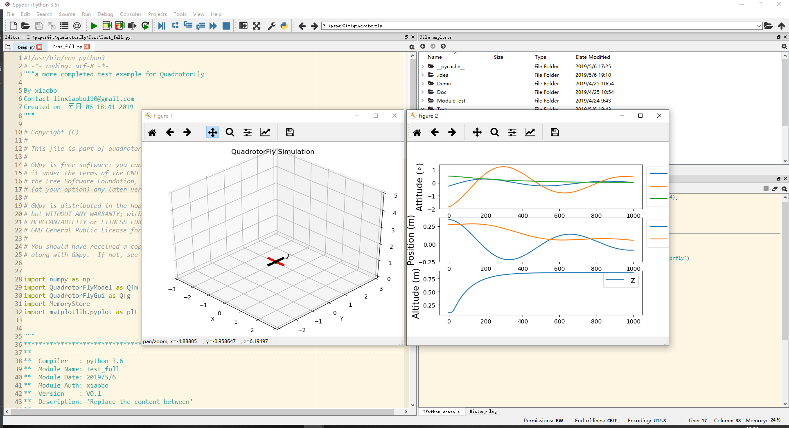
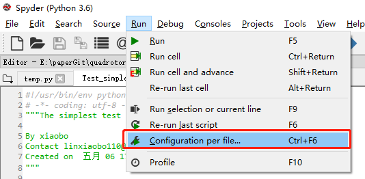
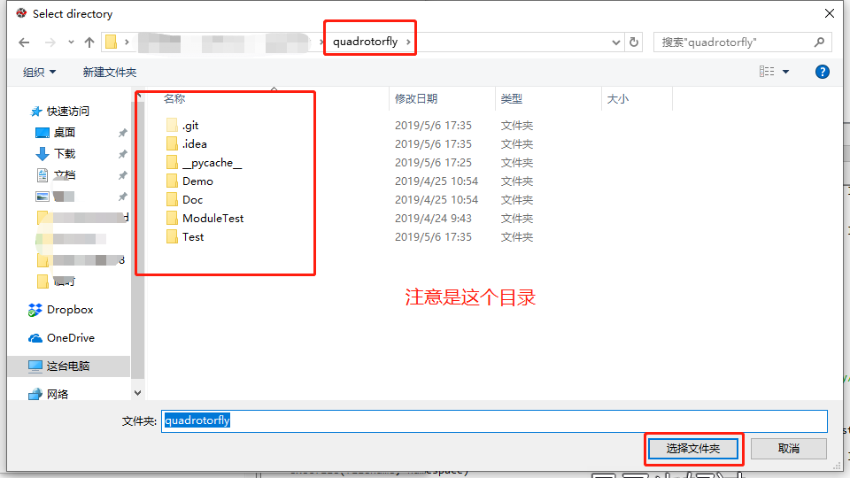
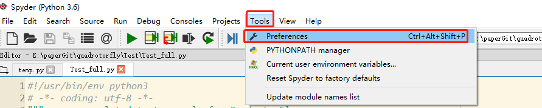
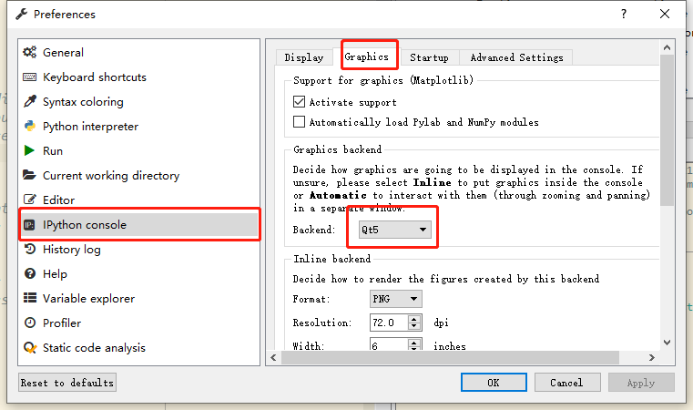

# README


# QuadrotorFly四旋翼无人机动力学模型

主要目的是开发一个用于无人机动力学仿真的简单易用、功能相对齐全的仿真环境（也许是水论文环境）。

# 主要功能（已实现）

## 模型功能

- [四旋翼基本动力学模型](#四旋翼基本动力学模型)，即电机推力到角速度、速度的动力学模型。
- [电机动力学模型](#电机动力学模型)，简化成一阶惯性系统，控制输入为百分比（即0-1的小数）。
- 系统干扰，作用在基本动力学模型上的均值可设定的随机噪声
- 机型选择，**'x'** 型或 **'+'** 型。见[常见机型](#常见四旋翼无人机机型)
- 提供了常见控制器以供参考，现有PD控制器
- 提供了奖励函数以供学习算法使用
- 状态边界检查，超出最大值后finish标志变成True 

## 仿真功能

- 支持随机初始位置、固定初始位置两种启动模式
- 采样时间可设定，状态更新方式采用4阶龙格库塔方法
- GUI动画，目前基于matplotlib搭建，支持多机

# 环境与依赖
## 环境
python3 + 你喜欢的编辑器
新手推荐anconda+spyder简单粗暴，入门建议anaconda+jupyter快捷稳定逼格高，想长期学习的建议anaconda+pycharm门槛高功能强大到难以想象。
## 需要的库
- numpy
- matplotlib

## 我使用的环境
- win10 + Anaconda （python 3.6）+ Pycharm

# 使用教程
这些程序在pycharm、spyder下运行通过。jupyter的测试程序是工程目录下的TestInJupyter.ipynb，模型可以运行不过gui动画不会动，暂时还没有修复。使用过程中有什么建议或者问题可以联系我729527658@qq.com.

## 测试
下载解压（建议使用git克隆）后运行其中的 **QuadrotorFlyTest.py**文件。
git克隆指令
```bash
git clone https://github.com/linxiaobo110/QuadrotorFly.git
```

成功运行可以看到以下效果：

运行结束后在画面单击可以看整个过程的飞行曲线


## 最简实现
不画图和记录数据，就是了解整个调用流程。可以在当前目录里新疆一个Test_simple.py（这个代码在Test文件夹里有），然后放入以下代码:
```python
# 包含头文件
import numpy as np
import QuadrotorFlyModel as Qfm
# 定义无人机参数
uavPara = Qfm.QuadParas()
# 定义仿真的参数
simPara = Qfm.QuadSimOpt()
# 使用参数新建一个无人机
quad1 = Qfm.QuadModel(uavPara, simPara)

# 仿真循环开始，总共1000步
print("Simplest simulation begin!")
for i in range(1000):
    # 设定目标，分别是x,y,z的位置，和偏航角的角度
    ref = np.array([0., 0., 1., 0.])
    # 获取无人机的状态，
    #   共12个维度分别是，xyz位置，xyz速度，roll pitch yaw姿态角，roll pitch yaw 角速度
    stateTemp = quad1.observe()
    # 通过无人机状态计算控制量，这也是自行设计控制器应修改的地方
    #    这是一个内置的控制器，返回值是给各个电机的控制量即油门的大小
    action2, oil = quad1.get_controller_pid(stateTemp, ref)
    # 使用控制量更新无人机，控制量是4维向量，范围0-1
    quad1.step(action2)
    
print("Simulation finish!")
```

遇到“No module name ‘QuadrotorFlyGui’ ”或者 “No module name ‘QuadrotorFlyModel’”，见[工程环境设置错误](#工程环境设置错误)。

## 自定义仿真参数
在工程下新建Test_full.py(这个代码在Test文件夹里有)，然后复制以下代码：

```python
# 包含文件
import numpy as np
import QuadrotorFlyModel as Qfm
import QuadrotorFlyGui as Qfg
import MemoryStore
import matplotlib.pyplot as plt
# 角度到弧度的转换
D2R = Qfm.D2R
# 仿真参数设置
simPara = Qfm.QuadSimOpt(
        # 初值重置方式（随机或者固定）；姿态初值参数（随机就是上限，固定就是设定值）；位置初值参数（同上）
        init_mode=Qfm.SimInitType.rand, init_att=np.array([5., 5., 5.]), init_pos=np.array([1., 1., 1.]),
        # 仿真运行的最大位置，最大速度，最大姿态角（角度，不是弧度注意），最大角速度（角度每秒）
        max_position=8, max_velocity=8, max_attitude=180, max_angular=200,
        # 系统噪声，分别在位置环和速度环
        sysnoise_bound_pos=0, sysnoise_bound_att=0,
        #执行器模式，简单模式没有电机动力学，
        actuator_mode=Qfm.ActuatorMode.dynamic
        )
# 无人机参数设置，可以为不同的无人机设置不同的参数
uavPara = Qfm.QuadParas(
        # 重力加速度；采样时间；机型plus或者x
        g=9.8, tim_sample=0.01, structure_type=Qfm.StructureType.quad_plus,
        # 无人机臂长（米）；质量（千克）；飞机绕三个轴的转动惯量（千克·平方米）
        uav_l=0.45, uav_m=1.5, uav_ixx=1.75e-2, uav_iyy=1.75e-2, uav_izz=3.18e-2,
        # 螺旋桨推力系数（牛每平方（弧度每秒）），螺旋桨扭力系数（牛·米每平方（弧度每秒）），旋翼转动惯量，
        rotor_ct=1.11e-5, rotor_cm=1.49e-7, rotor_i=9.9e-5,
        # 电机转速比例参数（度每秒），电机转速偏置参数（度每秒），电机相应时间（秒）
        rotor_cr=646, rotor_wb=166, rotor_t=1.36e-2
        )
# 使用参数新建无人机
quad1 = Qfm.QuadModel(uavPara, simPara)

# 初始化GUI，并添加无人机
gui = Qfg.QuadrotorFlyGui([quad1])

# 初始化记录器，用于记录飞行数据
record = MemoryStore.DataRecord()

# 重置系统
# 当需要跑多次重复实验时注意重置系统，
quad1.reset_states()
record.clear()

# 仿真过程
print("Simplest simulation begin!")
for i in range(1000):
    # 模型更新
    # 设置目标
    ref = np.array([0., 0., 1., 0.])
    # 获取无人机的状态，共12维的向量
    #   分别是，xyz位置，xyz速度，roll pitch yaw姿态角，roll pitch yaw 角速度
    stateTemp = quad1.observe()
    # 通过无人机状态计算控制量，这也是自行设计控制器应修改的地方
    #    这是一个内置的控制器，返回值是给各个电机的控制量即油门的大小
    action2, oil = quad1.get_controller_pid(stateTemp, ref)
    # 使用控制量更新无人机，控制量是4维向量，范围0-1
    quad1.step(action2)
    
    # 记录数据
    record.buffer_append((stateTemp, action2))
    
    # 渲染GUI
    gui.render()
    
# 输出结果
## 获取记录中的状态
bs = np.array([_[0] for _ in record.buffer])
## 获取记录中的控制量
ba = np.array([_[1] for _ in record.buffer])
## 生成时间序列
t = range(0, record.count)
## 画图
fig1 = plt.figure(2)
plt.clf()
## 姿态图
plt.subplot(3, 1, 1)
plt.plot(t, bs[t, 6] / D2R, label='roll')
plt.plot(t, bs[t, 7] / D2R, label='pitch')
plt.plot(t, bs[t, 8] / D2R, label='yaw')
plt.ylabel('Attitude $(\circ)$', fontsize=15)
plt.legend(fontsize=15, bbox_to_anchor=(1, 1.05))
## 位置图(xy)
plt.subplot(3, 1, 2)
plt.plot(t, bs[t, 0], label='x')
plt.plot(t, bs[t, 1], label='y')
plt.ylabel('Position (m)', fontsize=15)
plt.legend(fontsize=15, bbox_to_anchor=(1, 1.05))
## 高度图
plt.subplot(3, 1, 3)
plt.plot(t, bs[t, 2], label='z')
plt.ylabel('Altitude (m)', fontsize=15)
plt.legend(fontsize=15, bbox_to_anchor=(1, 1.05)) 
print("Simulation finish!")
```

在spyder下的运行效果：


如果遇到spyder运行时，图片在终端里显示（就是没有弹出新窗口），见[Spyder图形渲染设置](#spyder图形渲染设置)。

# 基础知识

## 常见四旋翼无人机机型

- **+** 型四旋翼无人机


- **X** 型四旋翼无人机


## 四旋翼基本动力学模型
$$
\begin{align}
\ddot{p}_x&=[\cos{\varphi}\sin{\theta}\cos{\psi}+\sin{\varphi}\sin{\psi}]\frac{\tau_0}{m} + d_1\\
\ddot{p}_y&=[\cos{\varphi}\sin{\theta}\sin{\psi}-\sin{\varphi}\cos{\psi}]\frac{\tau_0}{m} + d_2\\
\ddot{p}_z&=\cos{\theta}cos{\varphi}\frac{\tau_0}{m}-g + d_3\\
\ddot{\varphi}&=\dot{\varphi}\dot{\psi}(\frac{J_{zz}-J_{xx}}{J_{yy}}) + \frac{J_R}{J_{yy}}\dot{\varphi}\Omega_R + \frac{L}{J_{yy}}\tau_1 + d_4\\
\ddot{\theta}&=\dot{\theta}\dot{\psi} (\frac{J_{yy}-J_{zz}}{J_{xx}}) - \frac{J_R}{J_{xx}}\dot{\theta}\Omega_R +\frac{L}{J_{xx}}\tau_2 + d_5\\
\ddot{\psi}&=\dot{\theta}\dot{\varphi}(\frac{J_{xx}-J_{yy}}{J_{zz}}) + \frac{1}{J_{zz}}\tau_3 + d_6,
\end{align}
$$
其中$p_x,p_y,p_z$ 位置，$\varphi,\theta,\psi$是姿态，$\tau_{0，1,2,3}$分别是总体推力，绕x轴、y轴，z轴的扭力。

## 电机动力学模型
$$\begin{equation}
\begin{aligned}
\dot{\omega} &=\frac{1}{T}(-\omega+C_Ru+w_b)\\
T &= C_T\omega^2\\
M &= C_M \omega^2
\end{aligned}
\end{equation}\label{eq2}$$
其中$\omega$是电机的转速；$u$是输入给电机的控制信号；$T,M$分别是电机产生的推力和扭力。

## 动力学中的力与螺旋桨产生的力关系
以十型举例
$$\begin{align}
\tau_0 &= T_0 + T_1 + T_2 + T_3\\
\tau_1 &= T_1 - T_0\\
\tau_2 &= T_3 - T_2\\
\tau_3 &= -M_1 - M_2 + M_3 + M_4
\end{align}$$

# FAQ
## 工程环境设置错误

- 现象：
ModuleNotFoundError: No module named 'QuadrotorFlyGui'
- 原因：
这是因为工程运行的目录不是QuadrotorFly目录，比如在Test里，或者是在一个上级的目录。
- 解决办法

如果上级目录，修改import语句成
```python
# 其他类似
import QuadrotorFly.QuadrotorFlyGui
```

如果是在Test里，或者不确定在哪里，直接修改程序运行目录 
  1. spyder编辑器
选择为每个文件单独指定配置文件

选择指定文件夹

选择QuadrotorFly目录


## Spyder图形渲染设置
选择tool->preferences

设置合适的渲染工具，不是inline



